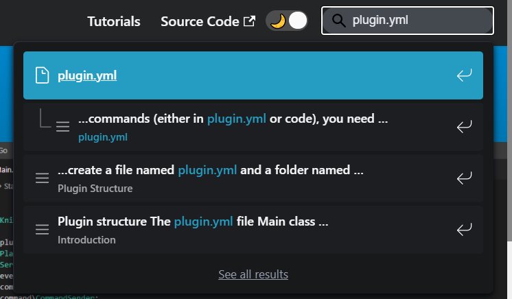

      
    <b>Một Trang Web Hướng Dẫn Mọi Thứ Về PocketMine-MP</b>  
    

---

### [**Tiếng Anh**](https://github.com/PocketMine-MP-VN-Group/Pocketmine-School)

## Về PocketMine School

PocketMine School là một trang web nơi bạn có thể tìm hiểu về PocketMine-MP. PocketMine School hiện đang được duy trì bởi [**TeamUltraSoft**](https://github.com/TeamUltraSoft) và [**KygekTeam**](https://github.com/KygekTeam). Phiên bản Tiếng Việt đang được duy trì bởi [**PocketMine-MPVNGroup**](https://github.com/PocketMine-MP-VN-Group).

## Tính năng

- Trang web Nhanh và Dễ đáp ứng
- Thanh tìm kiếm!
  
- Hướng dẫn về PHP căn bản và PocketMine-MP (Đang được hoàn thiện)
- Chế độ Sáng / Tối

## Làm thế nào để tôi có thế đóng góp cho PocketMine School?

Chúng tôi sẵn sàng nhận mọi đóng góp! Bạn có thể gửi đóng góp của bạn bằng cách mở [pull requests](https://github.com/PocketMine-MP-VN-Group/Pocketmine-School/pulls) hoặc [issues](https://github.com/PocketMine-MP-VN-Group/Pocketmine-School/issues) và chờ đợi phản hồi từ chúng tôi.

<!-- TODO: Add tutorial for building and testing PocketMine School locally -->

## Ghi chú bổ sung

**PocketMine School được:**
- Duy trì và phát triển bởi [**TeamUltraSoft**](https://github.com/TeamUltraSoft) và [**KygekTeam**](https://github.com/KygekTeam) dưới tổ chức [**PocketMine School**](https://github.com/PocketMine-School).
- Phiên bản Tiếng Việt bởi [**PocketMine-MPVNGroup**](https://github.com/PocketMine-MP-VN-Group).
- Được cấp phép theo [**Giấp phép MIT**](/LICENSE).

**Discord:** https://discord.gg/UpM96PSrJk

